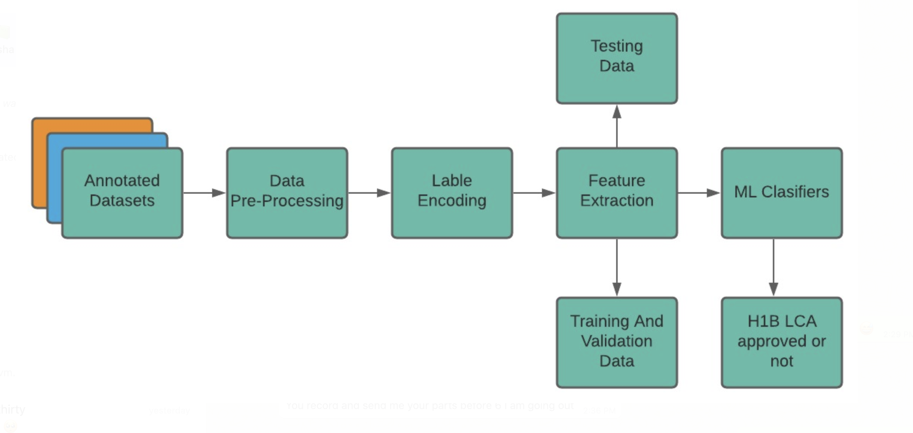
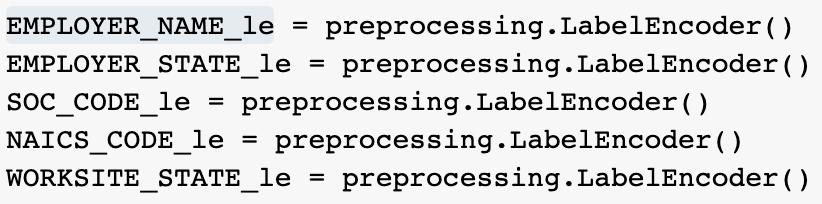
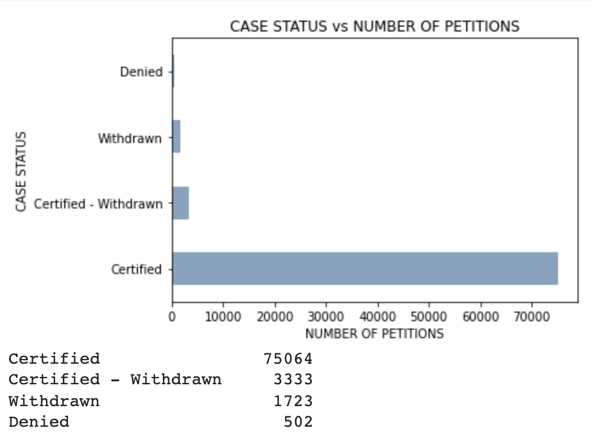
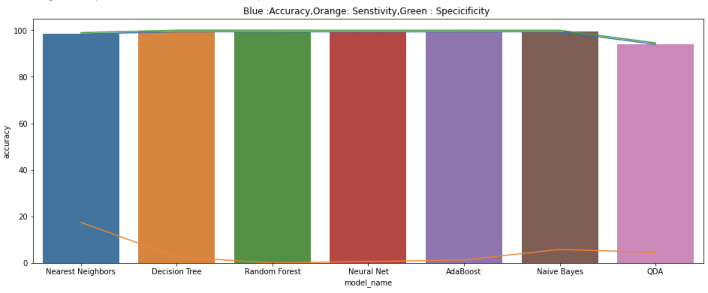
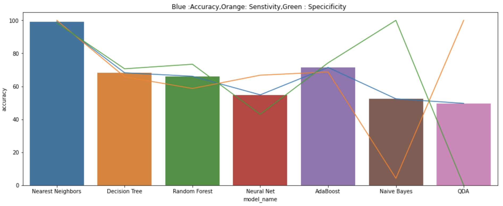
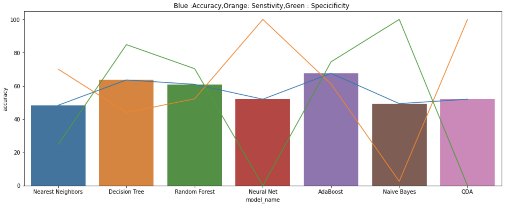
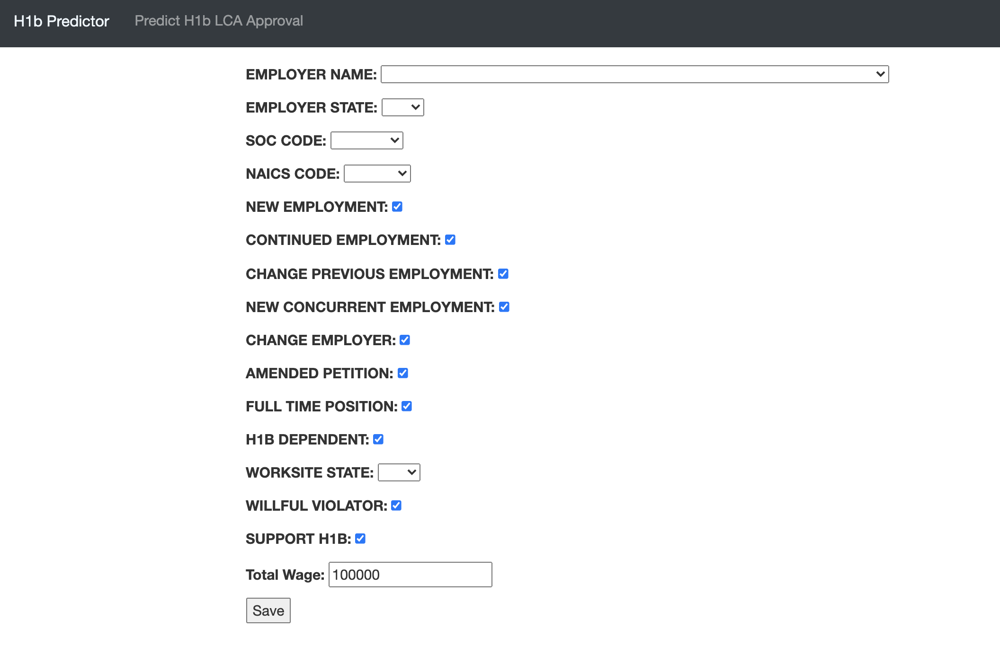

# H1B LCA Status Prediction

**Colab Link:** https://colab.research.google.com/drive/13n7u4Ojcz0fLXtOGAEAJyu7Q9LTU3OCb?usp=sharing

**Video Link:**

**SlideShare Link:**

**IEEE Paper Link:**

## Introduction

H-1B visas are applied by a large number of highly skilled foreign nations seeking employment in the United States, but only a small portion of individuals' visas are approved and allowed to work. The application for the visa is applied to the US embassy.There are various factors that affect the role of prediction for an approval of H-1B visa such as work experience, employer, proficiency, wage and many more. Our proposed model takes into account 16 such factors to predict the outcome of the visa application. We created a web application and deployed it in AWS EC2, which enables user to fill in the apllication details to predict the status of the Visa to be accepted or not.

## Data

The dataset is collected  from LCA (H-1B, H-1B1, E-3)  disclosure files which covers determinations issued between October 1, 2020, and September 30, 2021.
The dataset provides information on 96 attributes associated with the H1B applications which can be divided into classes for a more accurate understanding. 
Following are some of the fields that have been used for training the model.

* EMPLOYER_NAME: Legal business name of the employer submitting the Labor Condition Application
* NAICS_CODE: Industry code associated with the employer submitting the Labor Condition Application, as classified by the North American Industrial Classification System (NAICS).
* SOC_CODE: Occupational code associated with the job being requested for temporary labor conditions, as classified by the Standard Occupational Classification (SOC) System.
* FULL_TIME_POSITION: Y = Full Time Position; N = Part Time Position.
* NEW_EMPLOYMENT: Indicates requested worker(s) will begin employment for new employer,
as defined by USCIS.
* CONTINUED_EMPLOYMENT: Indicates requested worker(s) will be continuing employment with same
employer, as defined by USCIS.

# Method

**ML Pipeline:**

 

**Data acquisition:**

The ability of any ML model is based on the data it was trained on, larger, cleaner, annotated and appropriate data we have better the accuracy of the model we will have.
 
**Data Pre-processing:**

* We performed following steps such as:

* Filter only the required columns into the dataframe, which will be our input to the model.
* Checked any null values present in the records.
* Converting categorical values of fields WILLFUL_VIOLATOR, SUPPORT_H1B,  H1B_DEPENDENT etc, into numerical values for the model training. Also replacing null values with the majority entries.

**Label Encoding:**

Used label encoders to convert categorical values to numeric values. Following label values are converted to numeric.

* After converting we dumped the label encoders using pickle to use it in our Django App.

**Feature Extraction**

*Certified LCA*

*Rejected LCA*

*Total_Wage*

The dataset includes PREVAILING_WAGE_int which specifies the wage of the applicant Yearly, Hourly, Monthly Weekly & Biweekly. This occurrence of payment is given. by field WAGE_UNIT_OF_PAY. As it is difficult to use wages with different occurrences for the different employees, we have added a feature "Total_Wage", which specifies the annual income of the applicant.

We have deduced this by adding another feature "multiplier", which is used in the formula (df.PREVAILING_WAGE_int)*df.multiplier to calculate Total_Wage.

**Exploratory Data Analysis(EDA) and visualization:**

EDA is another crucial step which helps us to understand how data distribution looks like. It helps to understand the weight of features visually. There are many open source python based visualization libraries to perform EDA such as matplotlib, seaborn etc.

*Case Status v/s Number of Petitions*

**Train - Test Split Data:** 

Following is the list of metrics those are used to evaluate classification ML model:

Confusion matrix
Precision
Recall
F1 score
ROC and AUC curve
Accuracy

## Experiments and Result:

**Result of Preprocessing Data:**

 
From the above graph, it is deduced that most of the classifier models have an accuracy of 99.33. This is because the dataset has as huge as 75064 records for certified LCA candidates and only 500 records of rejected LCA candidates. Because of such data discrepancies, the model is overfitting.

Hence, to tackle this problem we have explored Upsampling and Downsampling.

**Result of Upsampling Data:**

Upsampling is a procedure where synthetically generated data points (corresponding to minority class) are injected into the dataset.

After this step, the counts of both the labels(certified LCA and rejected LCA) are almost the same. This equalization procedure prevents the model from inclining towards the majority class i.e. in our case it was certified LCA.

As a result of this experiment Nearest Neighbor Classifier out performed as compared to rest of the classifier and gives the accuracy of 99.2.

**Result of Downsampling Data:**

The highest acuuracy after downsampling was  67.5 for the classifier Adaboost, which is far less than what we achieved with upsampled data. Since the downsampled size was very less, the result given by the model was very biased. Hence we decided to not take downsampled model.

**UI ScreenShot:**

The applicant's details to be enetred in the web application.

